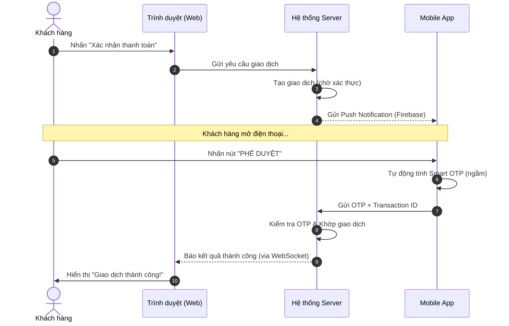

## BỐI CẢNH 1: BÀI TOÁN CHI PHÍ
Hệ thống giao dịch của chúng tôi đang sử dụng SMS OTP. Với lượng người dùng lớn và tần suất giao dịch cao (5-10 giao dịch/ngày), chi phí cho SMS đang tiêu tốn hàng trăm triệu VNĐ mỗi tháng, đồng thời thỉnh thoảng gặp tình trạng nghẽn mạng do nhà mạng. Công ty quyết định chuyển đổi sang **SMART OTP (Soft OTP)** – mã xác thực được sinh ra trực tiếp trên ứng dụng di động của khách hàng từ một Secret Key đã được mã hóa.

### Câu hỏi 1: 
Giả sử người dùng đã đăng nhập thành công. Hãy định nghĩa các API cần thiết để Client (Mobile App) và Server có thể thực hiện luồng Smart OTP này.
* Không cần implement, chỉ cần định nghĩa rõ (URL, HTTP Method, Request Payload, Response Payload).
* Không cần định nghĩa các mã lỗi HTTP tiêu chuẩn (4xx, 5xx).

## Trả lời:
* Một số API cần thiết mà Client (Mobile App) và Server cần thực hiện luồng Smart OTP này:
    * POST /api/v1/otp/enroll: Client gửi deviceId và userId lên để đăng ký.
    
    * POST /api/v1/otp/confirm-enroll: Khách nhập mã SMS OTP cuối cùng để xác nhận "chính chủ". Server sau đó trả về Secret Key đã mã hóa để App lưu vào vùng nhớ an toàn (Secure Enclave).
    
    * POST /api/v1/otp/verify: Dùng để xác thực giao dịch. Client gửi otp_code sinh ra từ App và transaction_id. (Bước cuối cùng để kiểm thử xem Smart OTP có hoạt động đúng không).

### Câu hỏi 2: 
Để xác thực Smart OTP, Server cần một class để kiểm tra mã OTP client gửi lên có khớp với mã Server tự tính toán ra hay không. Đặc thù của mã này là dựa trên thời gian (Time-based). 
* Hãy implement Core Logic cho tính năng này bằng Java. 
* *(Yêu cầu thực hiện code apply theo TDD và Clean Architecture).*

## Trả lời:
* Core Logic cho tính năng này bằng Java:

```java
package com.snowmen01.lab.domain;

public class OtpVerifier {

    private final OtpGenerator generator;
    private final int windowSize;
    private static final int TIME_STEP = 30000; // 30s

    public OtpVerifier(OtpGenerator generator, int windowSize) {
        this.generator = generator;
        this.windowSize = windowSize;
    }

    public boolean verify(String secret, String otpCode, long currentTimestamp) {
        if (otpCode == null || otpCode.length() != 6) {
            return false;
        }

        for (int i = -windowSize; i <= windowSize; i++) { // Check OTP trong khoảng thời gian trước / hiện tại / sau
            // |----------|----------|----------|
            //  30s TRƯỚC  Hiện tại   30s SAU (CHIA LẤY PHẦN NGUYÊN)
            long targetTimestamp = currentTimestamp + (long) i * TIME_STEP;
            String computedOtp = generator.generate(secret, targetTimestamp);
            if (computedOtp.equals(otpCode)) {
                return true;
            }
        }
        return false;
    }
}
```

### Câu hỏi 3: 
Lúc này nếu OTP client chỉnh thời gian chạy nhanh hơn thời gian của server 1 phút. Điều gì sẽ xảy ra? 
* Mô tả và giải thích chi tiết vấn đề ở đây. 
* **(Optional)** Hãy implement core logic để handle tính năng này *(Yêu cầu thực hiện code apply theo TDD và Clean Architecture)*. Việc implement lúc này solution của bạn đã đi từ TDD ra chưa, có tuân thủ Clean Architecture hay không.

## Trả lời:

### 1. Phân tích vấn đề:
Nếu Client chạy nhanh hơn Server 1 phút:
* Thuật toán TOTP chia thời gian thành các "Time Step" (mặc định 30 giây). 
* Khi Client nhanh hơn 1 phút, nó sẽ gửi mã OTP tương ứng với **2 bước thời gian (2 steps)** trong tương lai so với Server.
* Nếu Server chỉ kiểm tra khớp với thời gian hiện tại của mình, mã OTP sẽ bị báo **không hợp lệ (Invalid)**. Điều này gây ra trải nghiệm người dùng tệ (UX), khách hàng không hiểu tại sao mình nhập đúng số trên màn hình mà vẫn bị từ chối.

### 2. Giải pháp kỹ thuật:
Để xử lý vấn đề này, Server cần triển khai cơ chế **"Window Size" (Của sổ xác thực)**:
* Thay vì chỉ tính toán OTP cho thời điểm `T` (hiện tại), Server sẽ tính toán và chấp nhận các mã trong khoảng `[T - 2, T + 2]`.
* Với độ lệch 1 phút (2 steps), ta cần cấu hình `windowSize >= 2`.

### 3. Đánh giá về TDD và Clean Architecture:
Em đã tạo Unit Test cho các trường hợp | Ở giữa, 2 đầu và ngoài phạm vi
[INFO] -------------------------------------------------------
[INFO]  T E S T S
[INFO] -------------------------------------------------------
[INFO] Running com.snowmen01.lab.domain.OtpGeneratorTest
[INFO] Tests run: 3, Failures: 0, Errors: 0, Skipped: 0, Time elapsed: 0.100 s -- in com.snowmen01.lab.domain.OtpGeneratorTest
[INFO] Running com.snowmen01.lab.domain.OtpVerifierTest
[INFO] Tests run: 4, Failures: 0, Errors: 0, Skipped: 0, Time elapsed: 0.020 s -- in com.snowmen01.lab.domain.OtpVerifierTest
[INFO] 
[INFO] Results:
[INFO] 
[INFO] Tests run: 7, Failures: 0, Errors: 0, Skipped: 0
[INFO] 
[INFO] ------------------------------------------------------------------------
[INFO] BUILD SUCCESS
[INFO] ------------------------------------------------------------------------
[INFO] Total time:  5.654 s
[INFO] Finished at: 2026-03-17T14:47:07+07:00
[INFO] --   ----------------------------------------------------------------------


## BỐI CẢNH 2: TRẢI NGHIỆM ĐA NỀN TẢNG (OMNICHANNEL) 
Blossom (Đào) - Product Owner của chúng ta nhận ra một vấn đề về UX: 
> "Khách hàng của chúng ta dùng cả Web và Mobile. Nhưng chỉ Mobile mới sinh được Smart OTP. Chẳng lẽ khách đang đặt lệnh trên Web (Laptop), lại phải mò mẫm tìm điện thoại, mở app, copy 6 số rồi gõ ngược lại lên Web?"

Blossom muốn áp dụng luồng **Out-of-band Authentication (Xác thực ngoài luồng)**: 
* Khi khách đặt lệnh trên Web, Web không đòi nhập OTP. 
* Thay vào đó, một thông báo Push Notification / Realtime Message sẽ được đẩy thẳng xuống Mobile App của khách. 
* Khách chỉ cần mở điện thoại, bấm nút "Xác nhận giao dịch", Mobile App sẽ tự ngầm sinh Smart OTP và gửi lên Server. 
* Lệnh trên Web tự động báo thành công.

### Câu hỏi 4: 
Là 1 developer khi nhận được đầu bài từ PO như này bạn sẽ thiết kế hệ thống ra sao để đáp ứng được vấn đề đó? 
* Hãy vẽ 1 sequence diagram mô tả chi tiết về luồng này.

## Trả lời:

Luồng xác thực **Out-of-band (OOB)** giúp người dùng Web không cần nhập OTP thủ công mà xác thực trực tiếp trên App.



### Câu hỏi 5:
Vào những thời điểm thị trường biến động mạnh (ví dụ phiên ATC/ATO), lượng request xác thực giao dịch sẽ tăng đột biến (Spike traffic). 
* Bạn sẽ monitor (giám sát) những metric nào ở API "Xác thực OTP" để đảm bảo hệ thống đang hoạt động ổn định và sẵn sàng scale thêm?

## Trả lời:

Để đảm bảo hệ thống ổn định trong các đợt (phiên ATC/ATO hoặc phiên liên tục), em sẽ tập trung giám sát các chỉ số (Metric) sau:

1.  **RPS (Requests Per Second)**: Lưu lượng yêu cầu mỗi giây để biết khi nào bắt đầu chạm ngưỡng tải.
2.  **Latency (p99)**: Thời gian phản hồi của request.
3.  **Error Rate (4xx/5xx)**: Tỉ lệ request bị lỗi (4xx/5xx)
4.  **Database Connection Pool**: Theo dõi số lượng kết nối đang sử dụng (Active Connections). Đây thường là điểm nghẽn đầu tiên.
5.  **Thread Pool Usage**: Kiểm tra xem các worker thread có bị "kẹt" hay không.
6.  **CPU/RAM Utilization**: Thường thì em sẽ giữ hệ thống chạy ổn định như ram/cpu/disk không vượt ngưỡng 80%